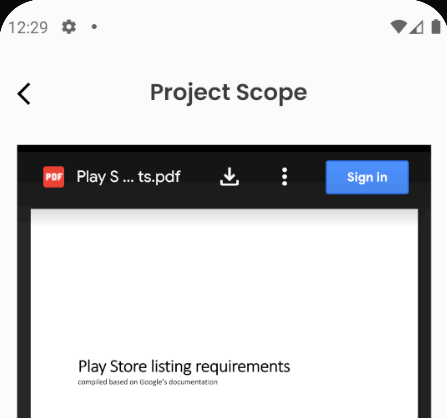
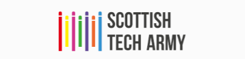
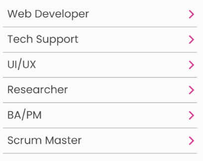
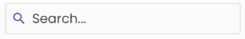
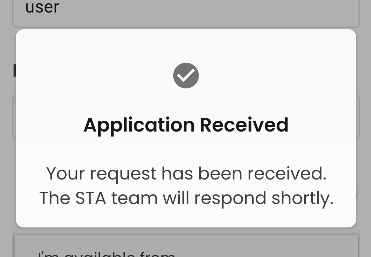
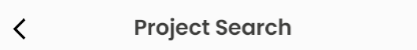
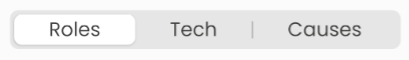
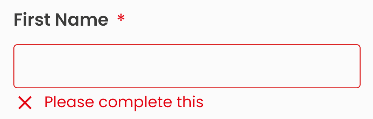

# App development

This file contains some tips and guidelines on building our front-end React Native app. Please add to it!

- [Overview of directories](#overview-of-directories)
- [Working with Figma](#working-with-figma)
- [React Native and Expo](#react-native-and-expo)
  - [Expo trade-offs](#expo-trade-offs)
  - [Installing new packages](#installing-new-packages)
  - [Using .env variables](#using-env-variables)
  - [Expo known issues](#expo-known-issues)
- [NativeBase](#nativebase)
  - [File locations, naming, moving and deleting](#file-locations-naming-moving-and-deleting)
  - [Theming & approach](#theming--approach)
  - [Dark mode](#dark-mode)
  - [Reusable containers](#reusable-containers)
  - [Custom components](#custom-components)
  - [Icons](#icons)
- [Images](#images)
- [Logging errors and crashes](#logging-errors-and-crashes)
  - [Seeing Bugsnag reports](#seeing-bugsnag-reports)
  - [Logging errors to Bugsnag during development](#logging-errors-to-bugsnag-during-development)
- [Performance issues](#performance-issues)

## Overview of directories

**Within the `app` directory here is an `app/assets` directory** which is used by Expo for things like the app icon and splash screen.

Most files live within the `app/src` directory.

**Below is a brief rundown of the different directories inside `/app/src` and what they're for.**

- `/Assets` -- fonts, images and other static files that are core to the app
- `/Components` -- custom components that make up different parts of an app screen, e.g. a date search that might belong inside an event search container
- `/Config` -- overall app configuration settings, e.g. the URL of the API
- `/Containers` -- screens content and logic
- `/Hooks` -- [React custom hooks](https://reactjs.org/docs/hooks-custom.html)
- `/NativeBase` -- assets, components and containers for the new app designs, using the NativeBase component library ([see more below](#nativebase))
- `/Navigators` -- defines the bottom tabs, which screens the user can navigate to within the app and which container to use for which screen
- `/Services` -- external services like our API, which we get projects and events data from
- `/Store` -- the [Redux store](https://medium.com/swlh/state-management-with-redux-react-native-a6369fcfe835) we use for more complex data sharing between containers/components
- `/Theme` -- existing (old) theme for controlling overall colours, fonts, spacing, etc - we are switching to handling this using NativeBase
- `/Translations` -- app text in different languages, currently we largely don't use this
- `/Types` -- some extra Typescript setup to enable different data types
- `/Utils` -- useful reusable functions to work with e.g. lists, searches, event dates and times

## Working with Figma

The app designs are produced in Figma. You can inspect different elements within a design by clicking on them (you might have to double-click to get to an element inside a group) -- and then on the right-hand side of the screen [you can inspect different properties](https://help.figma.com/hc/en-us/articles/360055203533-Use-the-Inspect-panel) e.g. the exact size in pixels, the spacing around it, colours, etc.

## React Native and Expo

Our app is built using React Native working with the [Expo CLI (command-line tool).](https://docs.expo.dev/more/expo-cli/) and [Expo Go.](https://expo.dev/client)

It's easy to be confused about React Native and Expo, partly because they have changed over time as has the relationship between them (it's easy to find articles which are out of date) and because there are different ways to use them.  [This article](https://retool.com/blog/expo-cli-vs-react-native-cli/) has quite a good background.

### Expo trade-offs

We are using the Expo CLI and Expo Go because they make development and deployment of the app a lot easier.  The main trade-off is that we cannot use every npm package that works with React Native.

There are many React Native packages we can use, but when it involves interacting with the device hardware (e.g. camera, GPS, etc) or the OS (e.g. the clipboard, file storage or sharing) or occasionally other areas (e.g. SVGs) then we are usually limited to packages that are supported as part of the Expo SDK library (but for the kind of app we're building, this should be ok).

You can see [the full list of Expo SDK libraries here](https://docs.expo.dev/versions/latest/sdk/accelerometer/) -- browse the menu to see all the different packages.

### Installing new packages

**To install new npm packages for the front-end app, always use** `npx expo install name-of-the-package-goes-here` instead of `npm install name-of-the-package-goes-here` -- this ensures the Expo CLI will install it properly if it's part of the Expo SDK library / needs some specific Expo setup that needs to be included with the installation of your package (if not, it'll simply install it using `npm`).

**For dev packages (for use in the development environment only), use** `npm install name-of-the-package-goes-here --save-dev`

### Using .env variables

You can use an `app/.env` file to store environment variables (often sensitive details like API keys, etc).

> Be careful about using sensitive details like passwords and API keys in the front-end app as it's possible for someone to break into an app on their phone and get this data. Consider whether this is the best approach and discuss with others in the team if you're not sure.

There are a few steps to add and use an environment variable using Expo:

1. Add your variable to the `app/.env` file, e.g. `AMAZING_API_KEY="abc123def456ghi789"`
2. Edit the `app/app.config.ts` file and add a new entry inside the `extra` object, e.g. `amazingApiKey: process.env.AMAZING_API_KEY,`
3. In the file in your code where you want to use this variable, add an import statement at the top of the file `import Constants from 'expo-constants'`
4. In the same file, at the place in the code where you want to use the variable, you can access your variable with e.g. `Constants.expoConfig?.extra?.amazingApiKey` (note: Typescript considers that the value of this could be `undefined`, so you may need to handle that possibility)

### Expo known issues

- **If the app on your phone isn't showing the latest changes in your code** first you could try reloading it -- while viewing the app in Expo Go, shake your phone and it should show you some options include 'Reload'
- **Sometimes the dev server loses connection with your phone** in which case you can try restarting Expo in your terminal -- press Ctrl+C to stop it, then run `npm start` again
- **If you're still having problems not seeing changes you have made on your phone** instead of `npm start` try `npm run start-clear-cache` (this does the same thing but also clears the Expo cache, so it'll be slower to load, but should force any changes to come through)
- **Previewing the app in Expo Go, it doesn't pick up the colour mode set on your phone** (we need to check, but assume this shouldn't be an issue when the app is built and deployed). For testing purposes you can manually set dark/light mode on the Settings screen.

## NativeBase

We are moving to the [NativeBase](https://nativebase.io/) component library as part of implementing new app designs. [Find the official docs here.](https://docs.nativebase.io/)

Changing a container/component to NativeBase involves (amongst other things):

- Using a NativeBase approach (see e.g. the Core Concepts, Features and Theme sections of the [official docs](https://docs.nativebase.io/))
- Using [the new StaTheme](#theming--approach) set up for NativeBase
- Removing uses of the old theme
- Replacing any uses of `styled` from `'styled-components/native'` with NativeBase components and theming
- Using NativeBase readymade components wherever possible

Please raise on the Slack channel any questions about how best we can use NativeBase, and how to keep coding approaches / ways of working consistent -- and add to this file updates that might help other people. This is especially important while we're in the early stages of figuring it all out.

### File locations, naming, moving and deleting

Currently, while we are in the process of transitioning different parts of the app to NativeBase and the new app designs, please put new assets (e.g. images), components and containers inside the `app/src/NativeBase` directory (e.g. `app/src/NativeBase/Components`).

Parts of the app like `Config`, `Hooks`, `Services`, `Store` don't need to move. There may be some other things where we need to make a judgement call.

If it makes sense to do so, you can a name new file the same as the old one it replaces (e.g. `app/src/Components/MyThing.tsx` can be `app/src/NativeBase/Components/MyThing.tsx`).

If an old non-NativeBase file is no longer needed in the app, please delete it as part of the pull request you're working on, so we don't have old files hanging around that aren't used any more.

### Theming & approach

NativeBase has [lots of handy out-of-the-box defaults](https://docs.nativebase.io/default-theme) set on the theme.

When we need to override this, we can do that in our theme file `app/src/NativeBase/Theme/StaTheme.tsx` [See here for the docs on theme customising.](https://docs.nativebase.io/customizing-theme) To see the full rundown of all the different things you can set, check out the NativeBase `extendTheme` file referenced in our StaTheme file (Ctrl-click or Command-click on `extendTheme` in the `import` statement at the top of the file to open it).

If you need to set something like colours, spacing, sizing, etc on a component or container you're working on, always think first **"could this be set as a theme default, rather than just setting it specifically on my component"**? Think ahead to whether this would help others in the team (and you!) in the future and help keep the app as consistent as possible, using as little code as needed in each individual component file.

### Dark mode

We allow the user to set their dark mode preference in the `SettingsContainer`. Code there and in `Navigators/Application` and `ColourModeManager` handle dark/light mode (what React Native and NativeBase call colour mode).

When you're building (or changing) a component or container, or changing a theme setting, please always check it works in dark mode as well as light mode.

NativeBase does some handling of dark mode straight out of the box, so you may not need to change anything.

**If you're switching a container to use NativeBase** check out `SettingsContainer` and `VerticalStackContainer` examples as they're already working reasonably well with dark mode. One of the things you'll need to do in your container is switch from using the old theme and switch from using any `styled` components/views.

**If you need to set colours based on dark/light mode** [see the docs here](https://docs.nativebase.io/dark-mode) and wherever possible set `_light` and `_dark` properties in the `StaTheme` file (approach 1. in the docs) rather than setting them on your individual component -- i.e. try to make settings as universal and as easily reusable as possible.

In case you need it, you can also use `useColorMode` or `useColorModeValue` to detect dark/light mode -- [see docs here](https://docs.nativebase.io/color-mode#h2-usecolormode) and an example in `app/src/NativeBase/Components/Brand`. But often you can do it using `_light` and `_dark` properties as described above.

**To find which colours to use for dark mode in Figma** see _Design System_ in the list of Pages on the left-hand side of the screen. There are examples of some components using dark mode.

### Reusable containers

Most containers are specific to a particular screen, but a few are reusable across multiple screens.

#### WebViewContainer

Displays an external web page inside our app, filling the available height

### Custom components

These are custom components we've developed, in addition to NativeBase readymade components:

#### Brand

Displays the wide version of the STA logo

#### ChoicesList

Tappable list of options to choose from, with arrows

#### FreeSearchBar

Text input for searching

#### Modal

A modal used to show the user a message. Can optionally include buttons to get the user's response/choice.

#### NavigationHeader

Shown at the top of some screens - a screen title and (optionally) a back button

#### SegmentedPicker

Useful for choosing between 2-3 choices, text must be kept very short (probably one word) for each

#### TopOfApp

Shown at the top of some screens - a small STA logo and (optionally) a search icon button

#### TextInputControl

Default text input, label, required indicator and validation/error message.

### Icons

Icons we use in the app are normally from the Material Icons library, implemented using the [react-native-vector-icons](https://github.com/oblador/react-native-vector-icons) package.

To add an icon into your component:

- Add imports at the top of your file from NativeBase and the icons library:

  - `import { Icon } from 'native-base'` (or add this to your existing `native-base` import statement)
  - `import MaterialIcons from 'react-native-vector-icons/MaterialIcons'`

- Insert the `<Icon/>` component:
  - `<Icon as={MaterialIcons} name="xxxxxx" />`
  - Replace `xxxxxx` with the name of the icon you want to use:
    - To find the name of the icon you're looking for, inspect the icon in Figma, in the Design panel on the right-hand side of the screen, go down to the Export section, and you should see the name beginning with `material-symbols:`
    - If you're not sure exactly how the icon is named, go to [the MaterialIcons font library](https://fonts.google.com/icons?selected=Material+Icons) and you can browse/search. Take the name as it appears there and convert it to kebab case -- e.g. for `Info` use `info`, for `Check Circle` use `check-circle`
  - See [the Icon docs](https://docs.nativebase.io/icon) for other properties you can set
  - See also [the IconButton component](https://docs.nativebase.io/icon-button)

## Images

For any images that are not photos and not icons -- for example, logos or any other vector designs -- it's better to use SVG format wherever possible. SVGs are smaller in file size and can scale to any width and height on-screen.

PNG, JPEG, GIF, etc images are better suited to photos. For icons use the NativeBase `<Icon />` component ([see above](#icons)).

We have the [react-native-svg](https://github.com/software-mansion/react-native-svg) package set up so you can use SVG images easily:

- Copy the .svg file into the `app/src/NativeBase/Assets/Images` directory (or a sub-directory)
- Import it at the top of your component file, e.g. `import StaLogoWide from '@/NativeBase/Assets/Images/Logos/sta-logo-wide.svg'`
- Use it like you would a normal component, e.g. `<StaLogoWide />`
- See `interface SvgProps` [in this file](https://github.com/software-mansion/react-native-svg/blob/main/src/elements/Svg.tsx) for common props you can use, and [here for touch events](https://github.com/software-mansion/react-native-svg/blob/main/USAGE.md#touch-events)

## Logging errors and crashes

We use Bugsnag to log errors and crashes in the front-end app when it's running on people's phones -- (otherwise we might not know if the app's going wrong when people are using it). To log errors to Bugsnag in the app in production, always use the `logError` function in `app/src/Service/modules/logging/index.ts` instead of `console.error` (it calls `console.error` itself anyway as part of what it does).

(While you're developing and testing out your code, you can still use `console.log` and `console.error` to see errors in your terminal.)

There are broadly two kinds of things that can go wrong on the front-end app:

- **Errors** Errors that happen in our React/Typescript code, either unforeseen or (ideally) caught in a `try...catch` statement. These are what's most likely to go wrong. The user can opt in/out of sending these kinds of errors, which are more likely to contain personal data. **Normally, these are only logged to Bugsnag when the app is installed on an actual device, rather than running in Expo Go during development.** This is so that we don't get flooded by lots of errors that occur during development, and because we're on a free tier package that only allows a limited number of error reports per day/month so we want to minimise the errors reported to Bugsnag to only include issues in production.
- **Crashes** The app can crash entirely e.g. if something goes wrong in a native library or the app runs out of memory, although this is probably unlikely with Expo. Logging these crash reports cannot be switched off, because Bugsnag starts when the first app loads. From an initial look, it appears these crash reports don't contain personal data.

Ordinarily, when you are developing using Expo Go, you should **not** have `BUGSNAG_API_KEY` set to the real API key value, otherwise it will send crash logs to Bugsnag which we usually don't want (ordinarily we only want to use Bugsnag to track errors and crashes on real devices).

  > You do need to set a value otherwise the app will not run, so you can use e.g. `BUGSNAG_API_KEY="no_api_key"`

  > During development, in the terminal window where you are running Expo you may see the message `[bugsnag] Bugsnag.start() was called more than once. Ignoring.`  You don't need to worry about this, it's just the app reloading and trying to start Bugsnag again.

### Seeing Bugsnag reports

Ask one of the team to add you to the **it470-volunteer-app-errors** Slack channel where you can see the latest bugs coming in from the app on real devices, and the API production server.

If you know a bug  has been fixed or can safely be ignored, please click the 'Mark as fixed' or 'Ignore' button on the error in the Slack message.

To get more details on a bug you'll need to go to [our Bugsnag inbox here](https://app.bugsnag.com/scottish-tech-army/volunteer-app/errors) -- you'll need the Bugsnag login details from another team member.  

  > Note: there are two Projects in Bugsnag -- one for the front-end app ('Volunteer app'), another for the API ('Volunteer app API'). Make sure you're looking at the right one. You can also filter by development/production.

  > When you look into an error, click on it in the Inbox in Bugsnag, then on the 'Stacktrace' tab you'll need to find where the error originated. The first entry in the stacktrace is just the `logging` module, you need to find what's below that and click to expand it to see where in the code the error actually occurred.

### Logging errors to Bugsnag during development

You can log errors to Bugsnag when developing in Expo Go if you really need to. **You shouldn't normally need to do this -- Bugsnag error logging is usually to monitor crashes and errors in the production app.  You should only use this in development when normal error detection is insufficient** e.g. because you want to figure out why the app is crashing due to a lack of memory.  **Don't** use this in place of normal code tools like `console.error` and `console.log` and other normal testing approaches.

You can force the app to report errors to Bugsnag during development using Expo Go (this also overrides the user permissions setting which normally determines whether or not send error reports).  To do this:

- Create a `app/.env` file if you don't have one already, and add `BUGSNAG_API_KEY="xxxxxxxxxxxxxxxx"` repacing `xxxxxxxxxxxxxxxx` with the value of our actual Bugsnag API key for the app (ask on the team Slack channel and someone can give you this -- note: the front-end app and the API use different Bugsnag API keys)
- In your `app/.env` file include the line `BUGSNAG_ALWAYS_SEND_BUGS="true"` (this forces the API to send errors to Bugsnag, even though you're in a development environment)
- Start/restart Expo and reload the app

**After you've finished testing you must:**

- Remove the `BUGSNAG_API_KEY` line from your `app/.env` file or comment it out by adding a `#` at the start of the line
- Remove the `BUGSNAG_ALWAYS_SEND_BUGS` line from your `app/.env` file or set it to `BUGSNAG_ALWAYS_SEND_BUGS="false"`
- Restart Expo and reload the app

## Performance issues

Have noticed occasional performance issues in the app emulator e.g. warnings that `serializablestateinvariantmiddleware` took a long time.

NativeBase does also have [some documented performance issues](https://github.com/GeekyAnts/NativeBase/issues/4302) but hopefully these won't hold us back (our app is relatively simple after all) and it looks like there are ongoing efforts to address these.
