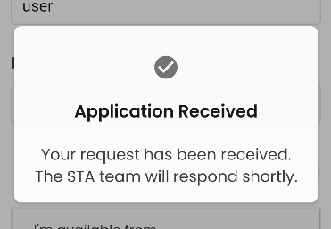

# App development

This file contains some tips and guidelines on building our front-end React Native app.  Please add to it!

- [Overview of directories](#overview-of-directories)
- [Working with Figma](#working-with-figma)
- [NativeBase](#nativebase)
  - [File locations, naming, moving and deleting](#file-locations-naming-moving-and-deleting)
  - [Theming & approach](#theming--approach)
  - [Dark mode](#dark-mode)
  - [Reusable containers](#reusable-containers)
  - [Custom components](#custom-components)
  - [Icons](#icons)
- [Images](#images)
- [Logging errors and crashes](#logging-errors-and-crashes)
- [Performance issues](#performance-issues)

## Overview of directories

**Below is a brief rundown of the different directories inside `/app/src` and what they're for.**

(There are also some other files and folders inside `/app` but you mostly won't need to touch these, unless for instance you're installing new npm packages or changing settings affecting Android or iOS. Please see also the [NativeBase section](#nativebase) below -- some files are moving into the `NativeBase` directory.)

- `/Assets` -- fonts, images and other static files that are core to the app
- `/Components` -- custom components that make up different parts of an app screen, e.g. a date search that might belong inside an event search container
- `/Config` -- overall app configuration settings, e.g. the URL of the API
- `/Containers` -- screens content and logic
- `/Hooks` -- [React custom hooks](https://reactjs.org/docs/hooks-custom.html)
- `/NativeBase` -- assets, components and containers for the new app designs, using the NativeBase component library ([see more below](#nativebase))
- `/Navigators` -- defines the bottom tabs, which screens the user can navigate to within the app and which container to use for which screen
- `/Services` -- external services like our API, which we get projects and events data from
- `/Store` -- the [Redux store](https://medium.com/swlh/state-management-with-redux-react-native-a6369fcfe835) we use for more complex data sharing between containers/components
- `/Theme` -- existing (old) theme for controlling overall colours, fonts, spacing, etc - we are switching to handling this using NativeBase
- `/Translations` -- app text in different languages, currently we largely don't use this
- `/Types` -- some extra Typescript setup to enable different data types
- `/Utils` -- useful reusable functions to work with e.g. lists, searches, event dates and times

## Working with Figma

The app designs are produced in Figma.  You can inspect different elements within a design by clicking on them (you might have to double-click to get to an element inside a group) -- and then on the right-hand side of the screen [you can inspect different properties](https://help.figma.com/hc/en-us/articles/360055203533-Use-the-Inspect-panel) e.g. the exact size in pixels, the spacing around it, colours, etc.

## NativeBase

We are moving to the [NativeBase](https://nativebase.io/) component library as part of implementing new app designs.  [Find the official docs here.](https://docs.nativebase.io/)

Changing a container/component to NativeBase involves (amongst other things):

- Using a NativeBase approach (see e.g. the Core Concepts, Features and Theme sections of the [official docs](https://docs.nativebase.io/))
- Using [the new StaTheme](#theming--approach) set up for NativeBase
- Removing uses of the old theme
- Replacing any uses of `styled` from `'styled-components/native'` with NativeBase components and theming
- Using NativeBase readymade components wherever possible

Please raise on the Slack channel any questions about how best we can use NativeBase, and how to keep coding approaches / ways of working consistent -- and add to this file updates that might help other people.  This is especially important while we're in the early stages of figuring it all out.

### File locations, naming, moving and deleting

Currently, while we are in the process of transitioning different parts of the app to NativeBase and the new app designs, please put new assets (e.g. images), components and containers inside the `app/src/NativeBase` directory (e.g. `app/src/NativeBase/Components`).

Parts of the app like `Config`, `Hooks`, `Services`, `Store` don't need to move.  There may be some other things where we need to make a judgement call.

If it makes sense to do so, you can a name new file the same as the old one it replaces (e.g. `app/src/Components/MyThing.tsx` can be `app/src/NativeBase/Components/MyThing.tsx`).

If an old non-NativeBase file is no longer needed in the app, please delete it as part of the pull request you're working on, so we don't have old files hanging around that aren't used any more.

### Theming & approach

NativeBase has [lots of handy out-of-the-box defaults](https://docs.nativebase.io/default-theme) set on the theme.

When we need to override this, we can do that in our theme file `app/src/NativeBase/Theme/StaTheme.tsx`  [See here for the docs on theme customising.](https://docs.nativebase.io/customizing-theme)  To see the full rundown of all the different things you can set, check out the NativeBase `extendTheme` file referenced in our StaTheme file (Ctrl-click or Command-click on `extendTheme` in the `import` statement at the top of the file to open it).

If you need to set something like colours, spacing, sizing, etc on a component or container you're working on, always think first **"could this be set as a theme default, rather than just setting it specifically on my component"**?  Think ahead to whether this would help others in the team (and you!) in the future and help keep the app as consistent as possible, using as little code as needed in each individual component file.

### Dark mode

We allow the user to set their dark mode preference in the `ProfileContainer`.  Code there and in `Navigators/Application` and `ColourModeManager` handle dark/light mode (what React Native and NativeBase call colour mode).

When you're building (or changing) a component or container, or changing a theme setting, please always check it works in dark mode as well as light mode.

NativeBase does some handling of dark mode straight out of the box, so you may not need to change anything.

**If you're switching a container to use NativeBase** check out `ProfileContainer` and `VerticalStackContainer` examples as they're already working reasonably well with dark mode.  One of the things you'll need to do in your container is switch from using the old theme and switch from using any `styled` components/views.

**If you need to set colours based on dark/light mode** [see the docs here](https://docs.nativebase.io/dark-mode) and wherever possible set `_light` and `_dark` properties in the `StaTheme` file (approach 1. in the docs) rather than setting them on your individual component -- i.e. try to make settings as universal and as easily reusable as possible.

In case you need it, you can also use `useColorMode` or `useColorModeValue` to detect dark/light mode -- [see docs here](https://docs.nativebase.io/color-mode#h2-usecolormode) and an example in `app/src/NativeBase/Components/Brand`.  But often you can do it using `_light` and `_dark` properties as described above.

**To find which colours to use for dark mode in Figma** see *Design System* in the list of Pages on the left-hand side of the screen.  There are examples of some components using dark mode.

### Reusable containers

Most containers are specific to a particular screen, but a few are reusable across multiple screens.

#### WebViewContainer

Displays an external web page inside our app, filling the available height

### Custom components

These are custom components we've developed, in addition to NativeBase readymade components:

#### Brand

Displays the wide version of the STA logo

#### ChoicesList

Tappable list of options to choose from, with arrows

#### FreeSearchBar

Text input for searching

#### NavigationHeader

Shown at the top of some screens - a screen title and (optionally) a back button

#### SegmentedPicker

Useful for choosing between 2-3 choices, text must be kept very short (probably one word) for each

#### TopOfApp

Shown at the top of some screens - a small STA logo and (optionally) a search icon button

#### TextInputControl

Default text input, label, required indicator and validation/error message.

#### ResponseModal

Shows the result of server interaction (e.g submitting a form) to the user.  Handles success/error.

### Icons

Icons we use in the app are normally from the Material Icons library, implemented using the [react-native-vector-icons](https://github.com/oblador/react-native-vector-icons) package.

To add an icon into your component:

- Add imports at the top of your file from NativeBase and the icons library:
  - `import { Icon } from 'native-base'` (or add this to your existing `native-base` import statement)
  - `import MaterialIcons from 'react-native-vector-icons/MaterialIcons'`

- Insert the `<Icon/>` component:
  - `<Icon as={MaterialIcons} name="xxxxxx" />`
  - Replace `xxxxxx` with the name of the icon you want to use:
    - To find the name of the icon you're looking for, inspect the icon in Figma, in the Design panel on the right-hand side of the screen, go down to the Export section, and you should see the name beginning with `material-symbols:`
    - If you're not sure exactly how the icon is named, go to [the MaterialIcons font library](https://fonts.google.com/icons?selected=Material+Icons) and you can browse/search.  Take the name as it appears there and convert it to kebab case -- e.g. for `Info` use `info`, for `Check Circle` use `check-circle`
  - See [the Icon docs](https://docs.nativebase.io/icon) for other properties you can set
  - See also [the IconButton component](https://docs.nativebase.io/icon-button)

## Images

For any images that are not photos and not icons -- for example, logos or any other vector designs -- it's better to use SVG format wherever possible.  SVGs are smaller in file size and can scale to any width and height on-screen.

PNG, JPEG, GIF, etc images are better suited to photos.  For icons use the NativeBase `<Icon />` component ([see above](#icons)).

We have the [react-native-svg](https://github.com/software-mansion/react-native-svg) package set up so you can use SVG images easily:

- Copy the .svg file into the `app/src/NativeBase/Assets/Images` directory (or a sub-directory)
- Import it at the top of your component file, e.g. `import StaLogoWide from '@/NativeBase/Assets/Images/Logos/sta-logo-wide.svg'`
- Use it like you would a normal component, e.g. `<StaLogoWide />`
- See `interface SvgProps` [in this file](https://github.com/software-mansion/react-native-svg/blob/main/src/elements/Svg.tsx) for common props you can use, and [here for touch events](https://github.com/software-mansion/react-native-svg/blob/main/USAGE.md#touch-events)

## Logging errors and crashes

We use Bugsnag to log errors and crashes in the front-end app when it's running on people's phones. There are broadly two kinds of things that can go wrong on the front-end app:

- **Errors** Errors that happen in our React code, either unforeseen or (ideally) caught in a `try...catch` statement. The user can opt in/out of sending these kinds of errors. Normally, these are only logged when the app is installed on an actual device, rather than running in an emulator. This is so that we don't get flooded by lots of errors that occur during development, and because we're on a free tier package that only allows a limited number of error reports per month so we want to minimise the errors reported to Bugsnag to only include issues in production.
- **Native crashes** The app can crash for other reasons e.g. if there's a problem with a native library or the app runs out of memory. Logging these cannot be switched off, because of the way these are triggered within the guts of the Android and iOS setup. These **will** still be logged if you're on an emulator because we can't control them.

To send errors and crash logs, you must have an `app/.env` file with this set `BUGSNAG_API_KEY="insert_key_here"` (replacing `insert_key_here` with the actual API key from Bugsnag).

### Logging errors to Bugsnag from your emulator

You can log errors to Bugnsag from your emulator if you really need to. **You don't normally need to do this -- Bugsnag error logging is usually to monitor native crashes, and errors in the production app.  You should only use this when normal error detection is insufficient** e.g. because you want to figure out why the app is crashing due to a lack of memory.  **Don't** use this in place of normal code tools like `console.error` and `console.log` and other normal testing approaches.

You can force the app to report errors (first bullet point above) to Bugsnag from the emulator (this also overrides the user permissions setting which normally determines whether or not send error reports).  To do this:

- Change the `version` number in `app/package.json` to one that isn't in use yet (if other developers are also doing the same thing, you'll need to coordinate with them so as not to overlap with using the same version number)
  > You must do this or it'll screw up error reporting for the current version of the app in production
- Change the `versionCode` number in `app/android/app/build.grade` (**not** `app/android/build.grade`) to one that isn't in use yet (if other developers are also doing the same thing, you'll need to coordinate with them so as not to overlap with using the same version code)
  > You must do this or it'll screw up error reporting for the current version of the app in production
- Run this command in your terminal to [manually upload source maps to Bugsnag](https://docs.bugsnag.com/build-integrations/js/source-maps-react-native/) so that it can detect where in the code a problem occurred: `npx bugsnag-source-maps upload-react-native --api-key YOUR_API_KEY_HERE --fetch --dev --platform android --app-version YOUR_APP_VERSION --app-version-code YOUR_APP_VERSION_CODE`
  - ...replacing `YOUR_API_KEY_HERE` with our Bugsnag API key
  - ...replacing `YOUR_APP_VERSION` with the version set in `app/package.json`
  - ...replacing `YOUR_APP_VERSION_CODE` with the version code set in `app/android/app/build.grade`
  - ...and if you are using the iOS emulator, also replace `android` with `ios`
  > You must re-run this command every time you change your code or Bugsnag may not correctly match an error to the right place in your React code
- Create an `app/.env` file or update your existing file and include the line `BUGSNAG_ALWAYS_SEND_BUGS="true"`
- Start/restart your emulator

**After you've finished testing you must:**

- Change back the `version` number in `app/package.json` to what it was before
- Change back the `versionCode` number in `app/android/app/build.grade` to what it was before
- Remove the `BUGSNAG_ALWAYS_SEND_BUGS` line from your `app/.env` file or set it to `BUGSNAG_ALWAYS_SEND_BUGS="false"`
- Restart your emulator

## Performance issues

Have noticed occasional performance issues in the app emulator e.g. warnings that `serializablestateinvariantmiddleware` took a long time.

NativeBase does also have [some documented performance issues](https://github.com/GeekyAnts/NativeBase/issues/4302) but hopefully these won't hold us back (our app is relatively simple after all) and it looks like there are ongoing efforts to address these.
